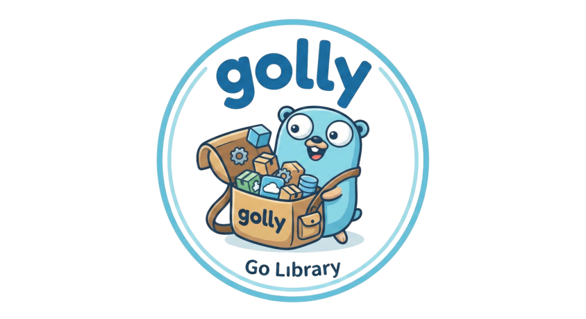

<p align="center">
  
</p>

<h1 align="center">Golly</h1>

<p align="center">
  <strong>A robust collection of enterprise-grade, reusable Go libraries</strong>
</p>

<p align="center">
  <a href="https://goreportcard.com/report/oss.nandlabs.io/golly"></a>
  <a href="https://github.com/nandlabs/golly/actions?query=event%3Apush+branch%3Amain+"></a>
  <a href="https://github.com/nandlabs/golly/releases/latest"></a>
  <a href="https://github.com/nandlabs/golly/releases/latest"></a>
  <a href="https://pkg.go.dev/oss.nandlabs.io/golly"></a>
  <a href="https://github.com/nandlabs/golly/blob/main/LICENSE"></a>
</p>

<p align="center">
  <a href="https://golly.nandlabs.io">Documentation</a> •
  <a href="#installation">Installation</a> •
  <a href="#core-packages">Packages</a> •
  <a href="#-cloud-integrations">Cloud Integrations</a> •
  <a href="#contributing">Contributing</a>
</p>

---

## Overview

Golly is a self-contained toolkit of common utilities for the Go programming language, designed to simplify and enhance enterprise software development. It minimizes external dependencies while providing modular, production-ready libraries for everything from HTTP routing and messaging to GenAI integrations.

## Goals

- Create reusable common collection of utilities targeting enterprise use cases
- Ensure the project is self-contained and minimise external dependencies

## Installation

```bash
go get oss.nandlabs.io/golly
```

## Core Packages

### 🔧 Fundamentals

| Package                              | Description                                                                   |
| ------------------------------------ | ----------------------------------------------------------------------------- |
| [assertion](assertion/README.md)     | Unified interface for asserting conditions with support for various types     |
| [cli](cli/README.md)                 | Easy-to-use API for building complex command structures with argument parsing |
| [collections](collections/README.md) | Generic data structures: Stack, Queue, List, LinkedList, Set (thread-safe)    |
| [config](config/README.md)           | Environment variable helpers and properties file management                   |
| [errutils](errutils/README.md)       | Custom formatted errors and multi-error aggregation                           |
| [fnutils](fnutils/README.md)         | Deferred and timed function execution utilities                               |

### 📡 Networking & Communication

| Package                          | Description                                                                                                     |
| -------------------------------- | --------------------------------------------------------------------------------------------------------------- |
| [clients](clients/README.md)     | HTTP client with auth providers, retry with backoff, and circuit breaker                                        |
| [rest](rest/README.md)           | HTTP server with routing, middleware, TLS, and transport configuration                                          |
| [turbo](turbo/README.md)         | Enterprise-grade HTTP router with path/query params, filters, CORS, and [auth](turbo/auth/README.md) middleware |
| [ws](ws/README.md)               | WebSocket client and server (RFC 6455) with auth, retry, circuit breaker, and auto-reconnect                    |
| [messaging](messaging/README.md) | General producer/consumer interfaces with local channel-based provider                                          |

### 🗃️ Data & Encoding

| Package                          | Description                                                                                     |
| -------------------------------- | ----------------------------------------------------------------------------------------------- |
| [codec](codec/README.md)         | Unified encoding/decoding for JSON, XML, YAML with [validation](codec/validator/README.md)      |
| [data](data/README.md)           | Pipeline key-value container with typed extraction and JSON Schema generation                   |
| [textutils](textutils/README.md) | Named ASCII character constants for readable code                                               |
| [semver](semver/README.md)       | Semantic versioning parser and comparator ([SemVer 2.0.0](https://semver.org/spec/v2.0.0.html)) |
| [uuid](uuid/README.md)           | UUID generation (V1–V4) and parsing                                                             |

### 🤖 AI & Intelligence

| Package                            | Description                                                                         |
| ---------------------------------- | ----------------------------------------------------------------------------------- |
| [genai](genai/README.md)           | Provider-agnostic GenAI/LLM interface with prompt templates and multi-part messages |
| [genai/impl](genai/impl/README.md) | OpenAI, Claude, and Ollama provider implementations                                 |

### � Security & Secrets

| Package                          | Description                                                                                                     |
| -------------------------------- | --------------------------------------------------------------------------------------------------------------- |
| [secrets](secrets/README.md)     | Comprehensive credential management: encryption algorithms (AES-CTR/GCM, ChaCha20), key versioning & rotation, credential types (API Key, Password, Certificate, Token), multi-cloud stores (AWS, GCP, Vault), and pluggable storage backends |

### ☁️ Cloud Integrations

| Repository                                      | Latest  | Description                                                                              |
| ----------------------------------------------- | ------- | ---------------------------------------------------------------------------------------- |
| [golly-aws](https://github.com/nandlabs/golly-aws) | v0.3.1 | AWS service integrations: S3, SNS, SQS, Bedrock, and **Secrets Manager** for credentials |
| [golly-gcp](https://github.com/nandlabs/golly-gcp) | v0.2.1 | GCP service integrations: Storage, Pub/Sub, GenAI, and **Secret Manager** for credentials |
| [golly-vault](https://github.com/nandlabs/golly-vault) | v0.1.0 | HashiCorp Vault integration for centralized secret management with KV engines and advanced auth |

### �🛠️ Infrastructure

| Package                          | Description                                                                                         |
| -------------------------------- | --------------------------------------------------------------------------------------------------- |
| [chrono](chrono/README.md)       | Task scheduler with cron, interval, and one-shot scheduling, pluggable storage, and cluster support |
| [fsutils](fsutils/README.md)     | Filesystem utilities: existence checks, content type detection                                      |
| [ioutils](ioutils/README.md)     | MIME type lookup, channel utilities, and checksum calculation                                       |
| [vfs](vfs/README.md)             | Virtual File System with unified interface, extensible for cloud storage                            |
| [l3](l3/README.md)               | Lightweight Levelled Logger with console/file writers and async support                             |
| [lifecycle](lifecycle/README.md) | Component lifecycle management with dependency ordering and state tracking                          |
| [managers](managers/README.md)   | Generic item manager for registering, retrieving, and listing named items                           |
| [pool](pool/README.md)           | Generic, thread-safe object pool with configurable capacity                                         |

### 🧪 Testing

| Package                                    | Description                                  |
| ------------------------------------------ | -------------------------------------------- |
| [testing/assert](testing/assert/README.md) | Lightweight assertion helpers for unit tests |

> 📖 Full API documentation available at [pkg.go.dev](https://pkg.go.dev/oss.nandlabs.io/golly)

---

## Contributing

We welcome contributions to the project. If you find a bug or would like to
request a new feature, please open an issue on
[GitHub](https://github.com/nandlabs/golly/issues).

## License

Licensed under either of

- Apache License, Version 2.0 ([LICENSE-APACHE](LICENSE-APACHE) or <http://www.apache.org/licenses/LICENSE-2.0>)
- MIT license ([LICENSE-MIT](LICENSE-MIT) or <http://opensource.org/licenses/MIT>)

at your option.

### Contribution

Unless you explicitly state otherwise, any contribution intentionally submitted
for inclusion in the work by you, as defined in the Apache-2.0 license, shall be
dual licensed as above, without any additional terms or conditions.
